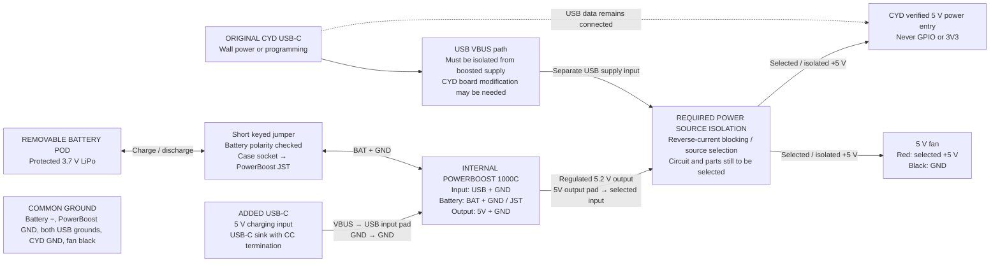

# Proposed battery and booster wiring

This is a power-topology diagram, not a finished soldering diagram. PowerBoost
pin names are documented by Adafruit; the CYD power-entry solder points and
source-isolation implementation have not been verified on the owner's board.
Do not connect the two supplies together as a shortcut.

## Connection intent

| Connection | Route |
| --- | --- |
| Battery | Protected LiPo positive/negative through the short keyed jumper to PowerBoost JST battery input. Verify actual connector and cable polarity; do not reuse the CYD BAT polarity assumption for the Adafruit socket. |
| Added USB-C | A 5 V USB-C sink input, with correct CC termination, to PowerBoost **USB input** and GND. Native 1000C charge jack is Micro-USB; the added USB-C socket is separate. Do not use VS or the 5V output as the charge input. |
| Booster output | PowerBoost **5V output** and GND. Positive goes through the required source isolation to the CYD's verified 5 V power entry. No output USB-A socket is needed. |
| Original CYD USB-C | Keep data for programming. Its power path needs isolation from the booster, potentially requiring a change to the board's VBUS path. A diode in the booster lead alone does not protect the host from booster power. |
| Fan | Selected 5 V supply and common ground, so it can run on either selected source. Not powered from an ESP GPIO. |
| Grounds | Common ground throughout; supply selection switches/isolates positive power, not USB data ground. |
| CYD BAT socket | Unused in this design. The battery connects to the PowerBoost charger only. |

With the pod absent, use the original CYD USB-C. With the pod attached, the
PowerBoost supports running the load while charging from the added socket.
Adafruit requires a LiPo attached for normal PowerBoost 1000C operation. Enable
(EN) controls booster output but does **not** replace source isolation.

A source selector or power mux must prevent either supply driving the other.
Exact switch/mux, current rating, charge-input current budget, CYD solder points,
and delivered jumper/socket fit must be selected and bench-tested before wiring.
The rail is a mechanical attachment, with a separate battery jumper.

Sources checked 2026-09-30:

- [Adafruit PowerBoost 1000C pinouts](https://learn.adafruit.com/adafruit-powerboost-1000c-load-share-usb-charge-boost/pinouts)
- [Adafruit PowerBoost 1000C product / load sharing](https://www.adafruit.com/product/2465)
- [Adafruit USB-C sink breakout example](https://www.adafruit.com/product/4090)
- [LCDWiki family-reference CYD schematic](https://www.lcdwiki.com/res/E32R35T/3.5inch_ESP32-32E_E32R35T_Schematic.pdf)
