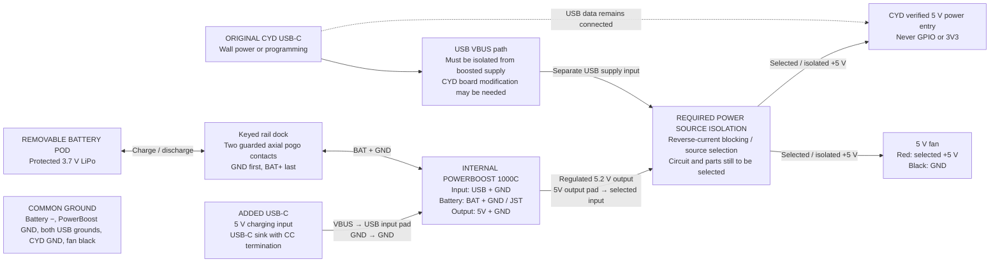

# Rail-carried battery and booster wiring — UNVALIDATED

[Open the interactive hardware wiring illustration](viewer/wiring.html).
The selector highlights each paired wire route and names its connections.
Component shapes and pad positions are illustrative, not verified footprints.

This is a power-topology diagram, not a finished soldering diagram. PowerBoost
pin names are documented by Adafruit; the CYD power-entry solder points and
source-isolation implementation have not been verified on the owner's board.
Do not connect the two supplies together as a shortcut.

## Connection intent

| Connection | Route |
| --- | --- |
| Battery | Protected LiPo → two recessed shoe pads → two shell pogo pins → short internal 24 AWG insulated leads to PowerBoost BAT/GND pads. No external jumper, grommet or case battery socket. Verify actual polarity before connecting the cell. |
| Added USB-C | A 5 V USB-C sink input, with correct CC termination, to PowerBoost **USB input** and GND. Native 1000C charge jack is Micro-USB; the added USB-C socket is separate. Do not use VS or the 5V output as the charge input. |
| Booster output | PowerBoost **5V output** and GND. Positive goes through the required source isolation to the CYD's verified 5 V power entry. No output USB-A socket is needed. |
| Original CYD USB-C | Keep data for programming. Its power path needs isolation from the booster, potentially requiring a change to the board's VBUS path. A diode in the booster lead alone does not protect the host from booster power. |
| Fan | Selected 5 V supply and common ground, so it can run on either selected source. Not powered from an ESP GPIO. |
| Grounds | Common ground throughout; supply selection switches/isolates positive power, not USB data ground. |
| CYD BAT socket | Unused in this design. The battery connects to the PowerBoost charger only. |

With the pod absent, use the original CYD USB-C. With the pod attached, the
PowerBoost supports running the load while charging from the added socket.
Adafruit requires a LiPo attached for normal PowerBoost 1000C operation. Enable
(EN) controls booster output but does **not** replace source isolation.

A source selector or power mux must prevent either supply driving the other.
Exact switch/mux, current rating, charge-input current budget, CYD solder points,
and dock fit must be selected and bench-tested before wiring.
The rail now carries battery power as well as mechanical alignment; the printed
plastic and lock take the loads, not the contacts. It is not a generic accessory
power bus: future accessories must match the battery-voltage interface explicitly.

## Selected contact mechanism and locking mount

Two **axial pogo pins**, one per polarity, in the female shell rail mate to two
flat gold pads in the male pod shoe. No magnets, exterior cables or sliding metal
tracks. The plunger axes are parallel to the x insertion direction; spring travel
absorbs final seating tolerance without side-loading the pins.

| Part | Quantity | Basis |
| --- | --- | --- |
| Mill-Max **0947-0-15-20-77-14-11-0** solder-cup pogo pin | 2 | Manufacturer 7 A at 30°C rise, **5.6 A derated**, 2.286 mm stroke, 12.217 mm free overall length, 1.60 mm mounting hole; solder cup accepts up to 24 AWG. |
| Harwin **S70-125161545R** contact pad | 2 | **6 A**, gold, 2.5 × 1.6 × 0.15 mm; use separate insulated pad carriers with solder lands. Carrier is provisional: 1.2 mm axial envelope, 2.7 mm width, must match delivered pads and harness. |
| ISO 4762 M3 × 12 socket-head screw | 1 | Pod lock-tab screw, accessible from rear, removable before sliding. Add a nonconductive retaining washer/tether if captivity is desired; washer geometry is not yet modeled. |
| DIN 934 M3 hex nut | 1 | 5.5 mm across flats, 2.4 mm thick; printed 5.7 mm AF loading pocket at x=40, y=24.5, from z=20.9 to 25.1, inside a 10 × 10 × 6 mm boss. Seat nut against its upper ceiling, giving 1.9 mm plastic above; secure it in the pocket before closing. Confirm full thread engagement; a washer stack changes the needed screw length. |
| Insulated 24 AWG stranded wire | 4 internal runs | Two pod leads and two shell leads; diameter allowance 1.3 mm. Bend/termination retention and delivered insulation fit require testing. |

Treat **2 A** as the design load assumption and test at **3 A** only with an
appropriate current-limited bench supply and dummy load. Do not infer a validated
5.6 A enclosure rating or a 3 A cell discharge rating from contact specifications.
Contact heating, wire insulation, solder lands, charger and cell limits may govern.
Manufacturer life is 100,000–1,000,000 cycles **at mid-stroke**; our positive pin
uses less than mid-stroke, so that cycle count is not a life claim for this dock.

### Placement, keying and engagement order

Rear-view SCAD coordinates are millimetres. Pin axes: z=28.6; GND y=22.5,
BAT+ y=26.5 (**4 mm pitch**). Free pin tips: GND x=38.0, BAT+ x=37.0.
Both pad faces are x=36.7 at the nominal screw-aligned pod placement x=44. Thus nominal
compression is 1.30 mm GND and 0.30 mm BAT+, below the 2.286 mm stroke.

Insertion is from the **right**, moving toward decreasing x. At 1.30 mm remaining
travel, GND makes; at 0.30 mm, BAT+ makes; the M3 lock hole aligns at zero travel.
The hood nose has another 0.05 mm to the hard stop; compression there is 1.35 mm
GND and 0.35 mm BAT+. Removal reverses this: BAT+ breaks at 0.30 mm, GND
at 1.30 mm. The nominal **1 mm sequencing margin** must survive accumulated
pin-length, pad-carrier and print tolerances. Measure and shim carriers as needed;
reject the assembly if the order is not repeatable. Do not bottom out either pin.

Separate insulating lanes keep each pin on its own pad throughout travel. Pads
are recessed **2.20 mm** behind the shoe hood front x=34.5; the shell comb ends
at x=38.8, **0.8 mm beyond the longest free pin**, guarding even charger-powered
case contacts. This is guarded/recessed, not waterproof or tool-proof: keep metal
debris away. Never use a common exposed conductive strip that can bridge poles.

A one-sided shoe key at y=27…30.45, z=28.3…29.1 runs along the shoe; the female
groove is y=26.8…30.7, z=28.1…29.3. Opposite wall remains solid. Reversing the pod
end-for-end puts the key on the blocked side and must stop insertion before the
contacts. The dock's closed end also prevents insertion from the left. The rail
cover has a relieved shoe and underside to clear the guarded dock, leaving a
0.8 mm minimum cover skin over it; confirm print strength and fit.

Pod wires rise from each pad, detour around the lock screw through y=21/28 floor
tunnels, rise inside the left pod wall at x=45.2, then emerge at z=44 above the
pouch. Shell pin solder cups face the interior access pockets; short leads go
to PowerBoost **BAT and GND**, never its USB/VS/5V pads. Assemble/insulate the
carriers before installing the battery. Pad supports and pin bores are printable
reservations: ream/fit the 1.60 mm pin bores to the actual parts, with mechanical
retention and strain relief. Do not rely on loose press fit or exposed solder.

### Required bench validation before energizing

1. With the cell and charger disconnected, verify each pad-to-pin route and
   polarity; check no continuity between BAT+ and GND or the lock hardware.
2. Use continuity probes on both lanes through slow insertion/removal, including
   wiggle and partial seating. Confirm ground-first/positive-last in every trial,
   no cross-lane touch, no pin bottoming and no possible reversed engagement.
3. Verify the printed stop, key, comb, cover, carrier retention and screw clearance
   physically; remove repeatedly without catching wires or levering the pins.
4. Use a current-limited bench supply/dummy load before the LiPo, verify voltage
   drop and temperature at the design load, and inspect after repeated cycling.
5. Check charger/backfeed behavior with the pod removed. Keep CYD USB supply
   isolation unresolved until its circuit is bench verified. Do not hot-swap under
   load: disable the booster and unplug charging power before removal.

This design remains **UNVALIDATED**. CAD topology/dimension checks cannot establish
contact safety, spring force, life, cell suitability, insulation or load rating.

Sources checked 2026-09-30:

- [Adafruit PowerBoost 1000C pinouts](https://learn.adafruit.com/adafruit-powerboost-1000c-load-share-usb-charge-boost/pinouts)
- [Adafruit PowerBoost 1000C product / load sharing](https://www.adafruit.com/product/2465)
- [Adafruit USB-C sink breakout example](https://www.adafruit.com/product/4090)
- [LCDWiki family-reference CYD schematic](https://www.lcdwiki.com/res/E32R35T/3.5inch_ESP32-32E_E32R35T_Schematic.pdf)
- [Mill-Max 0947 family specifications](https://www.mill-max.com/products/discrete-spring-loaded-pins/spring-loaded-pin-with-solder-cup-termination/0947)
- [Mill-Max manufacturer datasheet, distributor mirror](https://www1.futureelectronics.com/doc/Mill-Max/0947-0-15-20-77-14-11-0.pdf)
- [Harwin S70-125161545R specifications](https://www.harwin.com/products/S70-125161545R)

The local pod guard projects 4.15 mm beneath the 14 mm pod body (standalone
part depth 18.15 mm); 3.80 mm overlaps the main case. The docking block stops
0.05 mm before the guard nose. Contact compression and insulating comb fit must
be measured on printed parts; CAD clearance does not validate the electrical dock.
